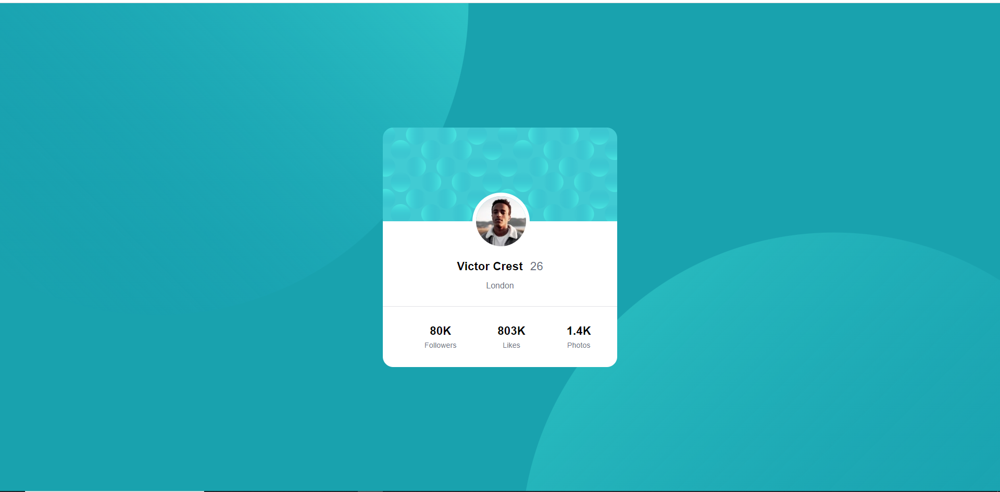
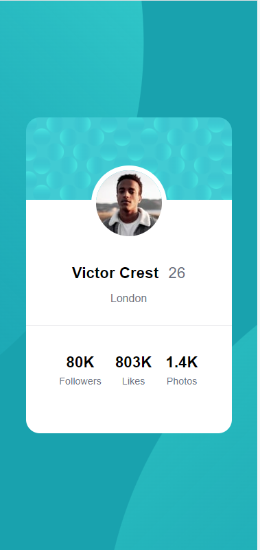

# Frontend Mentor - Profile card component solution

This is a solution to the [Profile card component challenge on Frontend Mentor](https://www.frontendmentor.io/challenges/profile-card-component-cfArpWshJ). Frontend Mentor challenges help you improve your coding skills by building realistic projects.

## Table of contents

- [Overview](#overview)
  - [The challenge](#the-challenge)
  - [Screenshot](#screenshot)
  - [Links](#links)
- [My process](#my-process)
  - [Built with](#built-with)
  - [What I learned](#what-i-learned)
  - [Continued development](#continued-development)
  - [Useful resources](#useful-resources)
- [Author](#author)
- [Acknowledgments](#acknowledgments)

## Overview

### The challenge

- To build the project same as the designs provided

### Screenshot

### Links

- Solution URL: [Github](hhttps://github.com/Priyanshi233/Profile-card-component)
- Live Site URL: [Netlify](https://brilliant-valkyrie-192a19.netlify.app/)

## My process

### Built with

- Semantic HTML5 markup
- CSS custom properties
- Flexbox
- Mobile-first workflow
- [Styled Components](https://styled-components.com/) - For styles

### What I learned

I learned a lot in this project about background images, their width, height, sizes and other properties.

### Continued development

I will continue to learn background images and their properties and improve my css.

### Useful resources

- [background images](https://www.w3schools.com/cssref/pr_background-image.asp)

## Author

- Website - [Priyanshi Somani](https://github.com/Priyanshi233)
- Frontend Mentor - [@Priyanshii677](https://www.frontendmentor.io/profile/Priyanshii677)

## Acknowledgments

Thank you to Google Search and the websites mentioned in the Useful resource section.
